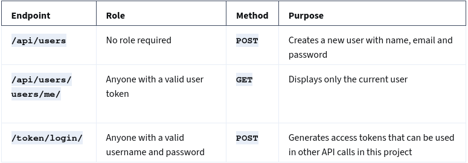
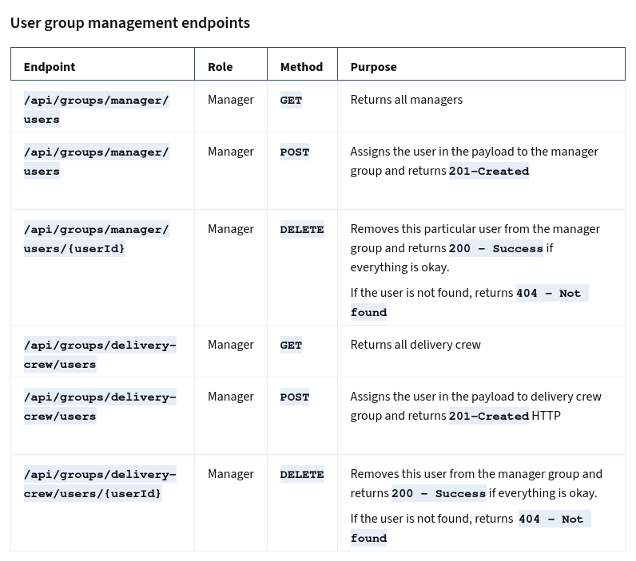
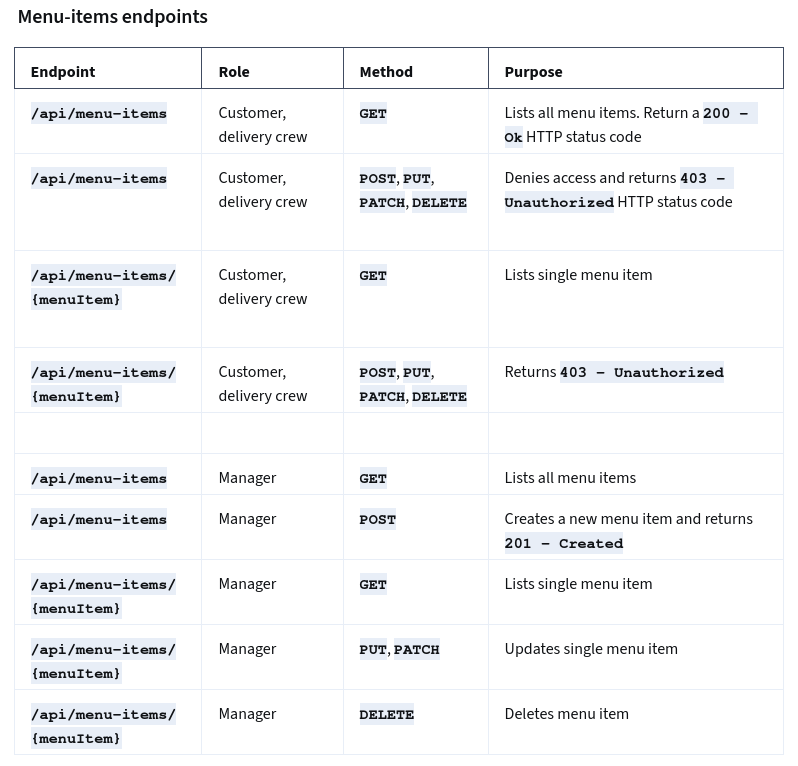
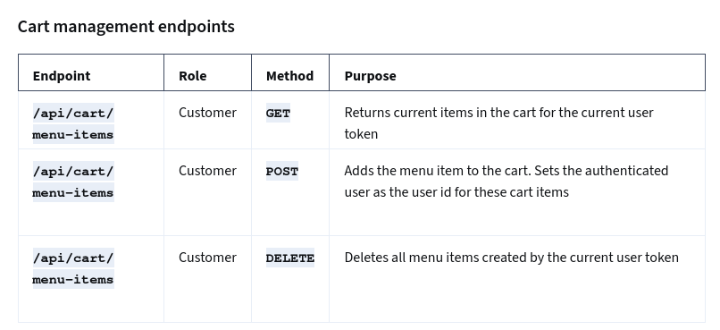
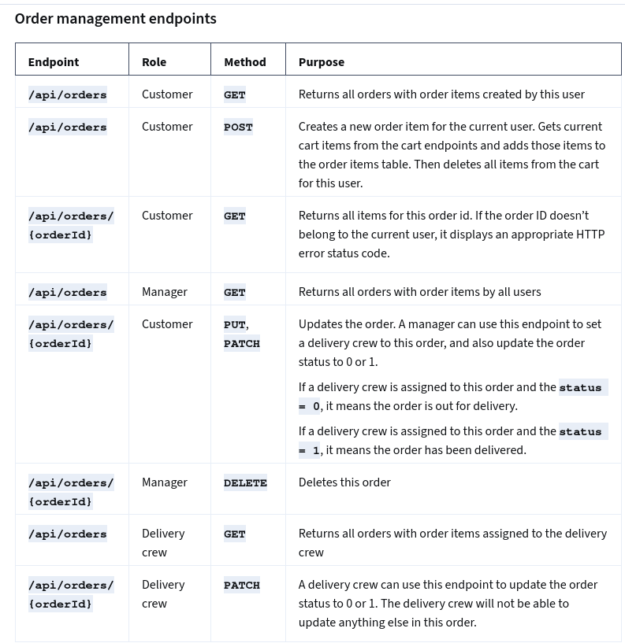

# API Project

A RESTful API for managing restaurant operations, including user authentication, menu management, cart handling, and order processing.

---

## 📌 Authentication & User Management

### User registration and token generation

### User group management

---

## 🍽️ Menu Management

### Menu item endpoints

---

## 🛒 Cart Management

### Cart endpoints

---

## 📦 Order Management

### Order endpoints

---

## 👥 Mock Users (For Testing)

| Role            | Username          | Password        |
|-----------------|-------------------|-----------------|
| Admin           | admin             | lemon@786!     |
| Manager         | mariana           | maripls@73     |
| Delivery Crew   | delivery_crew     | delivery@786!  |
| Customer        | customer_lemon    | customer@786!  |
| Customer        | customer_second   | customer@786!  |
